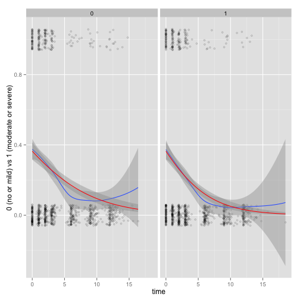

This project was done by [Emily Huang](http://www.jhsph.edu/departments/biostatistics/directory/students/phd.html) and [Leonardo Collado-Torres](http://bit.ly/LColladoTorres) for the [140.655 Analysis of Longitudinal Data](http://www.jhsph.edu/courses/course/140.655/01/2013/17988/) laboratory session 5 for biostatistics students.


## Instructions

```
Conduct, using a simulation, a sensitivity analysis of the change in effects
estimates as a function of the number of quadrature points.
Consider different integration methods.
```

As a reference/dataset starting point consider using (<span class="showtooltip" title="Lesaffre E and Spiessens B (2001). 'on The Effect of The Number of Quadrature Points in A Logistic Random Effects Model: an Example.' Journal of The Royal Statistical Society: Series C (Applied Statistics), 50, pp. 325-335. ISSN 0035-9254."><a href="http://dx.doi.org/10.1111/1467-9876.00237">Lesaffre & Spiessens, 2001</a></span>).


## Theory

Below some of the key theoretical points are shown. For more details, please check out the [presentation](http://lcolladotor.github.io/BiostatLab5/GLMM.pdf).

### General GLMM setup

1) Distribution assumption
* $Y_{ij}|b_{i}\sim$ Exponential family
* $Var(Y_{ij}|b_{i})=v\{E(Y_{ij}|b_{i})\}\phi$, where $v$ is a known function
* $Cov(Y_{ij},Y_{ik}|b_{i})=0$

2) Systematic component
* $\eta_{ij}=X_{ij}\beta+Z_{ij}b_{i}$

3) Link function
* $g\{E(Y_{ij}|b_{i})\}=\eta_{ij}=X_{ij}\beta+Z_{ij}b_{i}$ for some known link function, $g$

4) Random effects
* Assumed to have some probability distribution, such as $b_{i}\sim MVN(0,G)$
* $b_{i}$ are assumed to be independent of the covariates


### Gauss-Hermite Quadrature

$$ \int_{-\infty}^{\infty} h(v)e^{-v^{2}}dv \approx \sum_{k=1}^{d}h(x_{k})w_{k} $$

* $d$ quadrature points (weights, $w_{k}$, and evaluation points, $x_{k})$
* The more quadrature points used, the more accurate the approximation
* But computational burden increases with quadrature points, and grows exponentially with the number of random effects


## Quadrature exploration results

The `lme4` package includes the function `glmer` to fit GLMMs. For the purpose of this analysis, the `nAGQ` argument is the most important one.

    nAGQ: integer scalar - the number of points per axis for evaluating
          the adaptive Gauss-Hermite approximation to the
          log-likelihood.  Defaults to 1, corresponding to the Laplace
          approximation.  Values greater than 1 produce greater
          accuracy in the evaluation of the log-likelihood at the
          expense of speed.  A value of zero uses a faster but less
          exact form of parameter estimation for GLMMs by optimizing
          the random effects and the fixed-effects coefficients in the
          penalized iteratively reweighted least squares step.


### Contagious bovine pleuropneumonia

The `lme4` package includes the `cbpp` dataset which is described below:


     Contagious bovine pleuropneumonia (CBPP) is a major disease of
     cattle in Africa, caused by a mycoplasma.  This dataset describes
     the serological incidence of CBPP in zebu cattle during a
     follow-up survey implemented in 15 commercial herds located in the
     Boji district of Ethiopia.  The goal of the survey was to study
     the within-herd spread of CBPP in newly infected herds. Blood
     samples were quarterly collected from all animals of these herds
     to determine their CBPP status.  These data were used to compute
     the serological incidence of CBPP (new cases occurring during a
     given time period).  Some data are missing (lost to follow-up).


#### EDA

A quick exploration of the data set is shown below. In particular, we could be interested in the probability of serological cases by considering a random intercept by herd.


```
##       herd      incidence          size      period
##  1      : 4   Min.   : 0.00   Min.   : 2.0   1:15  
##  3      : 4   1st Qu.: 0.00   1st Qu.: 9.0   2:14  
##  4      : 4   Median : 1.00   Median :16.0   3:14  
##  5      : 4   Mean   : 1.77   Mean   :15.0   4:13  
##  6      : 4   3rd Qu.: 2.00   3rd Qu.:21.2         
##  7      : 4   Max.   :12.00   Max.   :34.0         
##  (Other):32
```

 


In the above plot we can see that the probability (number of events _incidence_ divided by the herd _size_) of serological events does change by herd.


#### Estimates vs quadrature points

We can now explore the results for 
* `nAGQ = 0` which estimates the coefficients in the penalized iteratively reweighted least squares step
* `nAGQ = 1` which is the equivalent to using the Laplace approximation
* `nAGQ = 2, 3, 4, 5, 10, 15, 20, 25` which specify different numbers of quadrature points. Note that the maximum `glmer` allows is 25.


The next plot shows how the resulting estimates for each of the coefficients changes by the `nAGQ` value. Estimates are shown with +- standard error bands. In this case, it stabilizes very quickly with the only noticeable different results being for `nAGQ = 0`.

 


#### P-values vs quadrature points

This plot shows the p-values for the coefficients by the different `nAGQ` values. The results from the previous plot are reflected in this one.

 


#### Criterions vs quadrature points

This plot shows the AIC and BIC criterions as well as the deviance ($-2 * \text{logLikelihood}$) for each of the `nAGQ` values. Compared to the previous results, we note a very large difference between values 1 and 2. The documentation for `glmer` states that using `nAGQ=9` provides a better evaluation of the deviance (meaning the log likelihood and thus the deviance, AIC and BIC).

 


#### Conclusions

With the `cbpp` dataset we can notice how using different `nAGQ` values can affect your estimates. Because of the model specification and dataset size, in this case there is nearly no computation burden for increasing the `nAGQ` values and you gain better deviance estimates.


### Two treatments for toe-nail infection

The data from (<span class="showtooltip" title="Lesaffre E and Spiessens B (2001). 'on The Effect of The Number of Quadrature Points in A Logistic Random Effects Model: an Example.' Journal of The Royal Statistical Society: Series C (Applied Statistics), 50, pp. 325-335. ISSN 0035-9254."><a href="http://dx.doi.org/10.1111/1467-9876.00237">Lesaffre & Spiessens, 2001</a></span>) is available [online](http://www.blackwellpublishers.co.uk/rss/). The researchers were interested in the degree of onycholysis which is related to the degree of separation of the nail plate from the nail-bed. The following shows a basic exploration of the available data.


```
##       idnr           y         trt          time       visit  
##  Min.   :  1   Min.   :0.000   0:937   Min.   : 0.00   1:294  
##  1st Qu.:102   1st Qu.:0.000   1:971   1st Qu.: 1.00   2:288  
##  Median :192   Median :0.000           Median : 3.00   3:283  
##  Mean   :190   Mean   :0.214           Mean   : 4.69   4:272  
##  3rd Qu.:276   3rd Qu.:0.000           3rd Qu.: 8.89   5:263  
##  Max.   :383   Max.   :1.000           Max.   :18.50   6:244  
##                                                        7:264
```

 


The previous plot shows whether the subjects had no or mild (0) versus moderate and severe (1) onycholysis. Two treatments (0 and 1) are compared against each other and subjects were observed up to 7 visits (there is some loss to follow-up). Y axis values are jittered to reduce overplotting. Red line is the fitted logistic regression while the blue line is the loess curve; both include their spreads.

The model explored was

$$ \text{logit}\{P(Y_{ij} = 1 | b_i, \beta)\} = \beta_0 + \beta_1 \text{treatment}_i + \beta_2 t_{ij} + \beta_3 t_{ij} \times \text{treatment}_i + \beta_i $$

where

* $Y_{ij}$ is the binary response at the $j$th visit of the $i$th subject
* $i = 1, \ldots, N$
* $j = 1, \ldots, n_i$
* $b_i = \sigma z_i$
* $z_i \sim N(0, 1)$

#### Estimates vs quadrature points

We can now explore the results for different numbers of quadrature points just like we did before. The next plot shows how the resulting estimates for each of the coefficients changes by the `nAGQ` value. Estimates are shown with +- standard error bands. 

In this dataset, the results are much more unstable (specially the intercept and treatment coefficients) for low values of `nAGQ`.

 


#### P-values vs quadrature points

This plot shows the p-values for the coefficients by the different `nAGQ` values. In contrast to the previous plot, we can observe how much the p-value for the _time_ coefficient is much more variable at low `nAGQ` values than the p-value for the treatment coefficient. It is also very important to note how the p-value for the interaction coefficient is not significant at the 0.05 confidence level for low `nAGQ` values.

 


#### Criterions vs quadrature points

This plot shows the AIC and BIC criterions as well as the deviance ($-2 * \text{logLikelihood}$) for each of the `nAGQ` values. As in the `cbpp` dataset, the log likelihood is very variable for low `nAGQ` values. The results are similar to the previously published results(<span class="showtooltip" title="Lesaffre E and Spiessens B (2001). 'on The Effect of The Number of Quadrature Points in A Logistic Random Effects Model: an Example.' Journal of The Royal Statistical Society: Series C (Applied Statistics), 50, pp. 325-335. ISSN 0035-9254."><a href="http://dx.doi.org/10.1111/1467-9876.00237">Lesaffre & Spiessens, 2001</a></span>) when they use NLMIXED with the adaptive method.

 


#### Conclusions

While the model structure was very similar to the `cbpp` dataset, the data itself presented a stronger challenge to the GLMM fitting methods due to the log likelihood surface (<span class="showtooltip" title="Lesaffre E and Spiessens B (2001). 'on The Effect of The Number of Quadrature Points in A Logistic Random Effects Model: an Example.' Journal of The Royal Statistical Society: Series C (Applied Statistics), 50, pp. 325-335. ISSN 0035-9254."><a href="http://dx.doi.org/10.1111/1467-9876.00237">Lesaffre & Spiessens, 2001</a></span>). Thus, if you fitted a GLMM assuming that the default number of quadrature points was enough, you would have gotten widely different results from the more numerically stable results from higher `nAGQ` values. It is thus important to check your results with higher `nAGQ` values.

Compared to the `cbpp` dataset, increasing the `nAGQ` value did lead to longer computing times but it was still very negligible. However, as stated in the `glmer` documentation, more complicated models will require much more computing power.


## References

Web document generated using `slidify` (<span class="showtooltip" title="Vaidyanathan R (2012). slidify: Generate reproducible html5 slides from R markdown. R package version 0.4."><a href="http://ramnathv.github.com/slidify/">Vaidyanathan, 2012</a></span>). Citations made with `knitcitations` (<span class="showtooltip" title="Boettiger C (2014). knitcitations: Citations for knitr markdown files. R package version 0.5-0."><a href="http://CRAN.R-project.org/package=knitcitations">Boettiger, 2014</a></span>). The presentation was made using `ShareLatex` (<span class="showtooltip" title="(2014). 'Online LaTeX Editor ShareLaTeX - ShareLaTeX.com.' ."><a href="https://www.sharelatex.com/">Oswald and Allen</a></span>).


-  Online LaTeX Editor ShareLaTeX - ShareLaTeX.com.  [https://www.sharelatex.com/](https://www.sharelatex.com/)
- Carl Boettiger,   (2014) knitcitations: Citations for knitr markdown files.  [http://CRAN.R-project.org/package=knitcitations](http://CRAN.R-project.org/package=knitcitations)
- Emmanuel Lesaffre, Bart Spiessens,   (2001) on The Effect of The Number of Quadrature Points in A Logistic Random Effects Model: an Example.  *Journal of The Royal Statistical Society: Series C (Applied Statistics)*  **50**  325-335  [10.1111/1467-9876.00237](http://dx.doi.org/10.1111/1467-9876.00237)
- Ramnath Vaidyanathan,   (2012) slidify: Generate reproducible html5 slides from R markdown.  [http://ramnathv.github.com/slidify/](http://ramnathv.github.com/slidify/)


## R code


```r
## Show the description of the nAGQ argument
library("gbRd")
cat(Rdo_args2txt("glmer", "nAGQ"))

## Show the cbpp dataset description
cat(paste(Rd_help2txt("cbpp", keep_section = "\\description", 
    omit_sec_header = TRUE), collapse = "\n"))

## Explore the cbpp dataset
summary(cbpp)

## Incidence/size vs period by herd
library("ggplot2")
eda1 <- ggplot(cbpp, aes(x = period, y = incidence/size, 
    group = 1)) + geom_point() + geom_line() + facet_grid(. ~ 
    herd)
eda1

## Get the results for different nAGQ values
library("reshape2")
quadrature <- function(formula, data) {
    ## Results place holder
    res <- vector("list", 10)
    names(res) <- c(0:5, 10, 15, 20, 25)
    aictab <- res
    for (i in names(res)) {
        j <- as.integer(i)
        ## Fit GLMM
        fit <- glmer(formula, data = data, family = binomial, 
            nAGQ = j)
        
        ## Extract coefficients and criterion values
        tmp <- summary(fit)$coefficients
        res[[i]] <- data.frame(cbind(tmp, nAGQ = rep(j, 
            nrow(tmp))), check.names = FALSE)
        res[[i]]$coef <- rownames(tmp)
        rownames(res[[i]]) <- NULL
        aictab[[i]] <- c(summary(fit)$AICtab, nAGQ = j)
    }
    
    ## Format results and get them ready for plotting
    res <- do.call(rbind, res)
    colnames(res) <- c("Estimate", "SE", "Zval", "Pval", 
        "nAGQ", "coef")
    aictab <- data.frame(do.call(rbind, aictab))
    aictab <- melt(aictab, id = "nAGQ")
    
    ## Finish
    final <- list(coef = res, aictab = aictab)
    return(final)
}

## Get the results for the cbpp data
cbpp.res <- quadrature("cbind(incidence, size - incidence) ~ period + (1 | herd)", 
    data = cbpp)

## Estimates (with SE) vs nAGQ by coefficient
p1 <- ggplot(cbpp.res$coef, aes(x = nAGQ, y = Estimate, 
    group = 1)) + geom_point() + geom_line() + facet_grid(. ~ 
    coef) + geom_ribbon(aes(ymin = Estimate - 1.96 * 
    SE, ymax = Estimate + 1.96 * SE), alpha = 0.2)
p1

## Pvalues vs nAGQ by coefficient
p2 <- ggplot(cbpp.res$coef, aes(x = nAGQ, y = -log10(Pval), 
    group = 1)) + geom_point() + geom_line() + facet_grid(. ~ 
    coef) + geom_hline(aes(yintercept = -log10(0.05)), 
    colour = "#BB0000", linetype = "dashed")
p2

## Criterions vs nAGQ
p3 <- ggplot(subset(cbpp.res$aictab, variable != "logLik"), 
    aes(x = nAGQ, y = value)) + geom_point() + geom_line() + 
    facet_grid(. ~ variable) + ylab("")
p3

## The data is available at
## http://onlinelibrary.wiley.com/journal/10.1111/(ISSN)1467-9876/homepage/50_3.htm
download.file("http://onlinelibrary.wiley.com/store/10.1111/(ISSN)1467-9876/asset/homepages/C4827r.txt?v=1&s=173f4c2fb8340abfc68445b88a6f6eadeb2c68ee&isAguDoi=false", 
    "C4827r.txt")

## Read the data
c48 <- read.table("C4827r.txt", col.names = c("idnr", 
    "y", "trt", "time", "visit"), colClasses = c("integer", 
    "integer", "factor", "numeric", "factor"))

## Basic exploration
summary(c48)

## Basic EDA
eda2 <- ggplot(c48, aes(x = time, y = y, group = 1)) + 
    geom_point(position = position_jitter(height = 0.06), 
        alpha = 1/5, shape = 21, size = 1.2) + stat_smooth(method = loess) + 
    stat_smooth(method = glm, family = binomial, colour = "red") + 
    ylab("0 (no or mild) vs 1 (moderate or severe)") + 
    facet_grid(. ~ trt)
eda2

## Get the results for the c48 data
c48.res <- quadrature("y ~ trt * time + (1 | idnr)", 
    data = c48)

## Estimates (with SE) vs nAGQ by coefficient
p4 <- ggplot(c48.res$coef, aes(x = nAGQ, y = Estimate, 
    group = 1)) + geom_point() + geom_line() + facet_grid(. ~ 
    coef) + geom_ribbon(aes(ymin = Estimate - 1.96 * 
    SE, ymax = Estimate + 1.96 * SE), alpha = 0.2)
p4


## Criterions vs nAGQ
p6 <- ggplot(subset(c48.res$aictab, variable != "logLik"), 
    aes(x = nAGQ, y = value)) + geom_point() + geom_line() + 
    facet_grid(. ~ variable) + ylab("")
p6

```


## Reproducibility

This report was last updated on


```
## [1] "2014-03-10 00:38:30 EDT"
```


R session information:


```
## R version 3.0.2 (2013-09-25)
## Platform: x86_64-apple-darwin10.8.0 (64-bit)
## 
## locale:
## [1] en_US.UTF-8/en_US.UTF-8/en_US.UTF-8/C/en_US.UTF-8/en_US.UTF-8
## 
## attached base packages:
## [1] tools     stats     graphics  grDevices utils     datasets  methods  
## [8] base     
## 
## other attached packages:
##  [1] reshape2_1.2.2      ggplot2_0.9.3.1     gbRd_0.4-11        
##  [4] knitcitations_0.5-0 bibtex_0.3-6        knitr_1.5          
##  [7] slidify_0.4         lme4_1.0-6          Matrix_1.1-2-2     
## [10] lattice_0.20-23    
## 
## loaded via a namespace (and not attached):
##  [1] codetools_0.2-8    colorspace_1.2-4   dichromat_2.0-0   
##  [4] digest_0.6.4       evaluate_0.5.1     formatR_0.10      
##  [7] grid_3.0.2         gtable_0.1.2       httr_0.2          
## [10] labeling_0.2       markdown_0.6.4     MASS_7.3-29       
## [13] minqa_1.2.3        munsell_0.4.2      nlme_3.1-111      
## [16] plyr_1.8           proto_0.3-10       RColorBrewer_1.0-5
## [19] Rcpp_0.11.0        RCurl_1.95-4.1     scales_0.2.3      
## [22] splines_3.0.2      stringr_0.6.2      whisker_0.3-2     
## [25] XML_3.95-0.2       xtable_1.7-1       yaml_2.1.10
```


```r
## Generate this report
library("slidify")
slidify("index.Rmd")
```


<div id='disqus_thread'></div>


